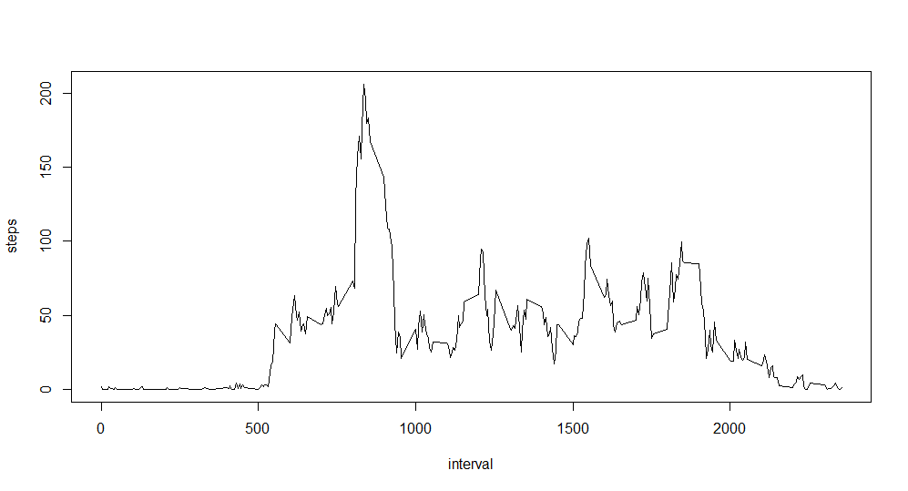
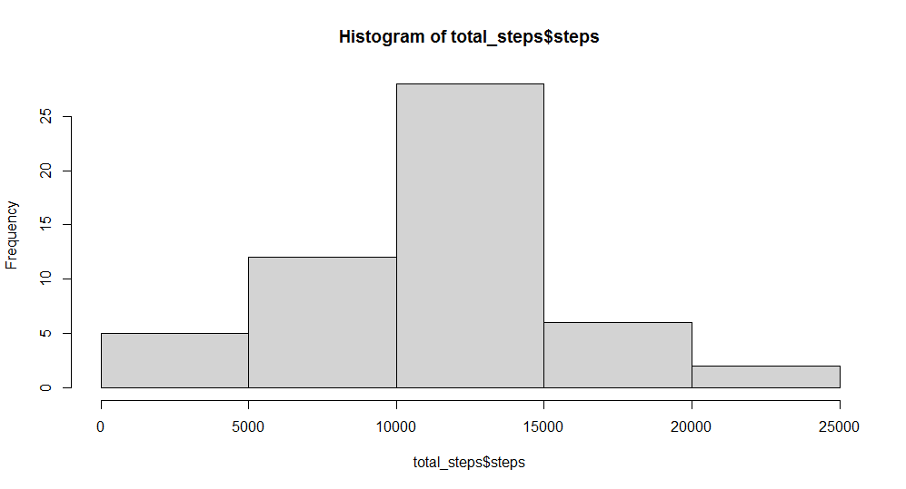
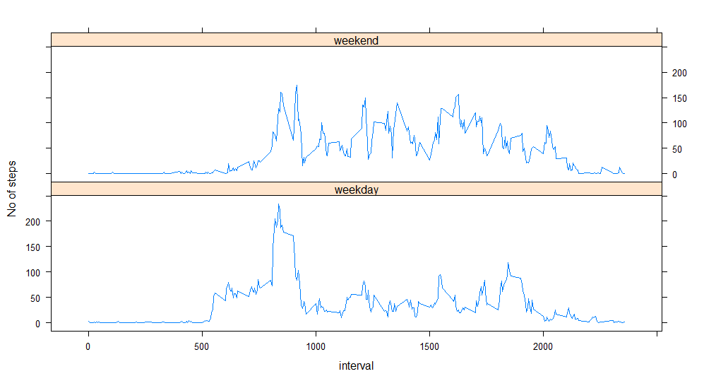

# Peer-graded-Assignment-Course-Project-1
Reproducible Research course
---

```{r setup, include=FALSE}
knitr::opts_chunk$set(echo = TRUE)
```

## Introduction
It is now possible to collect a large amount of data about personal movement using activity monitoring devices such as a Fitbit, Nike Fuelband, or Jawbone Up. These type of devices are part of the “quantified self” movement – a group of enthusiasts who take measurements about themselves regularly to improve their health, to find patterns in their behavior, or because they are tech geeks. But these data remain under-utilized both because the raw data are hard to obtain and there is a lack of statistical methods and software for processing and interpreting the data.

This assignment makes use of data from a personal activity monitoring device. This device collects data at 5 minute intervals through out the day. The data consists of two months of data from an anonymous individual collected during the months of October and November, 2012 and include the number of steps taken in 5 minute intervals each day. This task has been divided into a number of headings listed below for which there is a segment of R Code enclosed. Each task leading to a histogram or plot will have that plot/histogram after the segment of R Code

## Loading and preprocessing the data

The data for this assignment can be downloaded from the course web site:

Dataset: Activity monitoring data [52K]
The variables included in this dataset are:

*steps:* Number of steps taking in a 5-minute interval (missing values are coded as \color{red}{\verb|NA|}NA)
date: The date on which the measurement was taken in YYYY-MM-DD format
*interval:* Identifier for the 5-minute interval in which measurement was taken. 

The dataset is stored in a comma-separated-value (CSV) file and there are a total of 17,568 observations in this dataset. The following piece of R code is used to download the data and perform the initial preprocessing steps. This involves loading the appropriate libraries, downloading the database and unziping files.

```{r}
library(dplyr)
library(ggplot2)

## Download the database and unzip the files
if(!file.exists("~/data")){dir.create("~/data")}
fileUrl <- "https://d396qusza40orc.cloudfront.net/repdata%2Fdata%2Factivity.zip"
download.file(fileUrl,destfile="~/data/repdata_data_activity.zip")
setwd("~/data")
unzip("~/data/repdata_data_activity.zip", exdir="~/data")
activity<- read.csv("activity.csv", header=TRUE, sep=",")

activity$day<- weekdays(as.Date(activity$date))
activityDT<- as.POSIXct(activity$date, format="%Y-%m-%d")

Tablesteps<- aggregate(activity$steps ~ activity$date, FUN=sum, )
colnames(Tablesteps)<- c("date", "steps")
```


## What is mean total number of steps taken per day?
The tsk here is to calculate the total number of steps taken per day
from which we are instructed to make a histogram of the total number of steps taken each day
This is a histogram of total number of steps taken per day

```{r}
activity$day<- weekdays(as.Date(activity$date))
activityDT<- as.POSIXct(activity$date, format="%Y-%m-%d")

Tablesteps<- aggregate(activity$steps ~ activity$date, FUN=sum, )
colnames(Tablesteps)<- c("date", "steps")
hist(Tablesteps$steps, breaks=5, xlab = "steps", main = "Total number of steps per day of the week")
```
 

Finally we are instructed to calculate and report the mean and median values for the total number of steps taken per day. The following is the R code for the task. The following values are the mean and median number of steps per day
```{r, echo=FALSE}
mean(Tablesteps$steps)
median(Tablesteps$steps)
```

## What is the average daily activity pattern?

This task involves making a time series plot of the 5-minute interval (x-axis) and the average number of steps taken, averaged across all days (y-axis)
From this we can identify which 5-minute interval contains the maximum number of steps? (on average across all the days in the dataset). The following short code will perform this task:
```{r}
stepsdata<- activity[!is.na(activity$steps),]
stepsPerInterval<-aggregate(steps~interval, data=stepsdata, mean)
plot(steps~interval, data=stepsPerInterval,type="l")
```
 

## Imputing missing values

Imputation is Creating a new dataset that is equal to the original dataset but with the missing data filled in. Note that there are a number of days/intervals where there are missing values. The presence of missing days may introduce bias into some calculations or summaries of the data.

Our tak is to calculate and report the total number of missing values in the dataset (i.e. the total number of rows with \color{red}{\verb|NA|}NAs) adn devise a strategy for filling in all of the missing values in the dataset. 

Such a strategy is called imputation. Imputation does not need to be sophisticated. For example, you could use the mean/median for that day, or the mean for that 5-minute interval, etc.
If you fill the missing values with the measure of central tendency (such as the mean or average value) in theory you will not introduce bias, provided that the data is not heavily skewed. This theory can be tested by calculating the mean and median values before and after the imoutation step. 

Make a histogram of the total number of steps taken each day and calculate and report the mean and median total number of steps taken per day. Do these values differ from the estimates from the first part of the assignment? What is the impact of imputing missing data on the estimates of the total daily number of steps?
The following is the R code to perform the above task:

```{r}
Max_steps_interval<- stepsPerInterval[which.max(stepsPerInterval$steps),]$interval
Max_steps_interval

##calculating the number of missing values
missing_values<- sum(is.na(activity$steps))
missing_values

mean_stepInterval<- function(interval){
  stepsPerInterval[stepsPerInterval==interval,]$steps
}

activityData<- stepsdata
  for(i in 1:nrow(activityData)){
    if(is.na(activityData[i,]$steps)){
      activityData[i,]$steps <- mean_stepInterval(activityData[i,]$interval)
    }
  }
total_steps<- aggregate(steps~date, data=activityData, sum)
hist(total_steps$steps)

mean(total_steps$steps)
median(total_steps$steps)
```
 

The following values are mean and median values calculated from the steps data after imputation (which are the same as before imputation: 

```{r, echo=FALSE}
mean(total_steps$steps)
median(total_steps$steps)
```
## Are there differences in activity patterns between weekdays and weekends?

For this part the \color{red}{\verb|weekdays()|}weekdays() function may be of some help here. Use the dataset with the filled-in missing values for this part.

Create a new factor variable in the dataset with two levels – “weekday” and “weekend” indicating whether a given date is a weekday or weekend day.
Make a panel plot containing a time series plot (i.e. \color{red}{\verb|type = "l"|}type = "l") of the 5-minute interval (x-axis) and the average number of steps taken, averaged across all weekday days or weekend days (y-axis). See the README file in the GitHub repository to see an example of what this plot should look like using simulated data.
This is the R code used to perform the task:

```{r, echo=FALSE}
activityData$date<- as.Date(activityData$date, format= "%Y-%m-%d")
activityData$day<- weekdays(activityData$date)
for (i in 1:nrow(activityData)){
  if (activityData[i,]$day %in% c("Saturday", "Sunday")){
    activityData[i,]$day<- "weekend"
  }
   else{
    activityData[i,]$day<- "weekday"
  }
}

stepsByDay <- aggregate(activityData$steps ~ activityData$interval + activityData$day, activityData, mean)

names(stepsByDay)<- c("interval", "day", "steps")

library(lattice)
xyplot(steps ~ interval | day, stepsByDay, type="l", layout = c(1,2),
  xlab="interval", ylab="No of steps",  
    Main="activity during weekdays and weekends")
```

 
